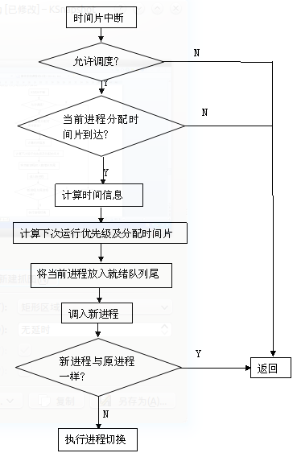

# Diers 操作系统实战

>* @Author: 万力
>* @MailTo: codelifeliwan@sina.com
>* @Site: https://www.jianshu.com/u/7877737aaa6a

## 介绍
自主实现的小型操作系统。想学习的自主下载代码跟着本文档更改哦~

## 目录介绍

* <a href="#1">前言</a>
* <a href="#2">第一章：目录介绍</a>
* <a href="#3">第二章：开机引导</a>
* <a href="#4">    一、计算机加电时自动为我们做了哪些？</a>
* <a href="#5">    二、 实模式与boot.asm</a>
* <a href="#6">    三、 保护模式分段与setup.asm</a>
* <a href="#7">    四、 jump.asm说明</a>
* <a href="#8">    五、 保护模式分页与set.asm</a>
* <a href="#9">第三章：内核初始化</a>
* <a href="#10">第四章：中断处理与定时器</a>
* <a href="#11">    一、 实模式下的中断系统</a>
* <a href="#12">    二、 保护模式下的中断系统</a>
* <a href="#13">    三、 定时器</a>
* <a href="#14">第五章：进程系统</a>
* <a href="#15">    一、进程控制块PCB</a>
* <a href="#16">    二、 任务状态段TSS</a>
* <a href="#17">    三、 局部描述符表LDT</a>
* <a href="#18">    四、 进程系统的初始化</a>
* <a href="#19">    五、 进程的创建</a>
* <a href="#20">    六、 进程的调度</a>
* <a href="#21">    七、进程的结束</a>
* <a href="#22">第六章：内存管理</a>
* <a href="#23">第七章：其他</a>
* <a href="#24">开发环境</a>
* <a href="#25">参考资料</a>

***

## <a name="1">前言</a>
本篇是我在学习操作系统的过程中按照自己的思路来构建的一个操作系统，但是由于我自己也是从零开始学起的，所以初期设计等难免会有不当之处，到最后功能上几乎没有做全的，但是对于想研究操作系统怎么实现的人来说我想也应该是一个财富吧，我尽量用最简洁直观的语言来描述，我想读了这篇论文您就会有勇气去读Linux的源代码了，因为Diers除了软件设计以外，硬件部分和早期的Linux存在很大的相似之处，Diers的部分代码也是参照Linux来实现的。另外，由于目前感觉内存分配和堆栈使用什么的有点不合理，所以Diers准备在以后重写，我也可能会单独开个网站来维护更新，敬请关注。另外请注意，Diers的所有汇编（C语言内嵌汇编除外）均使用nasm语法编写。
***

## <a name="2">第一章：目录介绍</a>
在`Diers`目录里面有两个大目录，一个是`in`，一个是`tools`，`in`里面放的是所有的源代码，`tools`里面放的是编译临时文件和写入工具等。

注意：请不要随意删除`tools`里面的东西，如果您想清除，那么只需要在`Diers`目录下`make clean`即可。在`Diers`目录下还有个`Diers.img`，这个就是我们想要的编译的结果，您可以在bochs或者virtualbox下运行调试。在`in`里面有几个目录如下：

```
in
|----boot-------------------------------存放开机引导文件
|----dev--------------------------------存放设备控制文件
|    |----blk--------------------------块设备
|    |    |----floppy---------------软盘
|    |    |----hd--------------------硬盘
|    |----char------------------------字符设备
|    |    |----fkeyboard-----------键盘
|    |    |----monit----------------显示器
|    |----net--------------------------网络部分
|    |----oth--------------------------其他
|----fs----------------------------------文件系统
|----int---------------------------------中断处理
|    |----clk--------------------------时钟中断
|    |----interrupt-------------------其他中断
|----kernel----------------------------主函数入口部分
|----lib---------------------------------库文件
|    |----math------------------------数学处理文件
|    |----str---------------------------字符串处理
|----mm--------------------------------内存管理
|    |----pro--------------------------进程调度
|----out---------------------------------临时输出文件
```
以后讲的代码都是以`in/`为根目录，如果想找什么文件，或者哪一个模块的代码，直接对照上图找即可。
***

## <a name="3">第二章：开机引导</a>
#### <a name="4">一、计算机加电时自动为我们做了哪些？<a>
从计算机加电开始，计算机就开始进行一系列的自检工作，这个自检工作是由加电时计算机发送给BIOS的一个信号，BIOS进行一部分固定代码复制来实现的。复制后执行这段代码来检查和初始化各个设备。初始化完毕后由BIOS来对磁盘进行相关启动检查，当它检查到某个磁盘的第一扇区（前512字节）的最后两个字节是0xaa55的时候就将其当作启动盘，否则继续检查下一磁盘。找到启动盘以后就将这512字节读到内存的绝对地址的0x07c00处，然后就开始执行0x07c00处的代码，此时CS寄存器为0，然后其他的工作就交给我们程序员了。可见，如果你想写一个引导程序，那么你需要以下几个条件：
>1、程序大小为512字节。  
2、程序加载到0x07c00处。  
3、程序最后两个字节为0xAA55。  
4、它放在磁盘的开始处（0磁道，1扇区）。  

那么比如说下面这段代码就可以当作引导：
```
;==============================================
org	0x7c00	;重定位到0x7c00此时的cs寄存器已经为0x0000
times	510-($-$$)	db	0	;用0填充510字节内的空间
dw	0xaa55	;引导标志
;==============================================
```
这段代码什么也不做，单纯的引导。
那么下面看看Diers在引导部分做的工作。

#### <a name="5">二、实模式与boot.asm</a>
计算机加电的时候开始是运行在实模式下的，什么是实模式呢？简单的说就是为了兼容以前的8086版本而设置的一种CPU只能寻址1MB内存空间的模式，在这种模式下代码是以最原始最简单的方式运行，就是普通的段基址+偏移量，每个段大小不能超过64KB（2^16），中断也是最简单的方式，中断向量表的每个表项就只有该中断处理程序的CS和IP，具体存放地点和这开机的1MB内存如下所示：
```
0x00000~0x003ff：中断向量表
0x00400~0x004ff：BIOS数据区
0x00500~0x07bff：自由内存区
0x07c00~0x07dff：引导程序加载区
0x07e00~0x9ffff：自由内存区
0xa0000~0xbffff：显存区
0xc0000~0xfffff：BIOS中断处理程序区
```
由于CPU在实模式下只能寻址1MB，这1MB每块内存都各自有其用处，所以对于现代的操作系统来说是远远不够的。这就需要另外一种模式：保护模式。保护模式将在下面讲解。

Diers的开机引导部分在/in/boot/里面，首先执行的是boot.asm的代码，在boot.asm中首先保存设备号（保存到0x80000），然后显示开机引导信息，然后把setup程序从磁盘读到0x9000:0x0000处，然后跳转到0x9000:0x0000即setup程序处执行，其中大部分功能比如磁盘读取、字符串显示、光标定位等都是使用BIOS中断来完成，更多关于BIOS中断请参考齐志儒、高福祥 《汇编语言程序设计》。

为了让入门更简单，以下给出boot.asm程序说明：
```
	org	0x7c00		;重定位到0x7c00处
	jmp	start		;跳转到start处执行

	SETUPSEG	equ	0x9000 ;setup程序将要加载到的地方
	DATASEG		equ	0x8000 ;数据将要保存的地方
	ROOT_DEV	db	0      ;设备号

start:
	mov	ax,cs
	mov	ds,ax
	mov	es,ax
	mov	ss,ax		;另各段寄存器与CS相等
	mov	[ROOT_DEV],dl	;保存设备号
	call	load_msg	;显示启动信息
	
	mov	ax,DATASEG
	mov	ds,ax
	mov	[0],dl		;将设备号保存到0x80000处
	
	mov	ax,cs
	mov	ds,ax
	
load_setup:			;使用0x13号中断来加载setup程序
	mov	ax,SETUPSEG
	mov	es,ax
	xor	bx,bx		;es:bx指向数据缓冲区
	mov	ax,0x0202	;ah存放功能号，02表示读磁盘到内存，al为读出扇区数量
	mov	dl,[ROOT_DEV]	;dl为驱动器号
	mov	dh,0		;dh为磁头号
	mov	cx,0x0002	;ch为磁道号低8位，cl：开始扇区(0~5)，磁道号高2位(6~7)
	int	0x13		;读取磁盘
	jnc	ok_load_setup	;读写成功则CF复位，否则CF置位
	mov	ax,0		;功能号为0,磁盘复位
	mov	dx,0
	int	0x13		;磁盘复位
	jmp	load_setup
	
ok_load_setup:
	jmp	SETUPSEG:0x0000	;跳转到setup程序运行

load_msg:	
	call	load_curser	;加载光标位置
	mov	ax,loadmessage
	mov	cx,18
	mov	bp,ax
	mov	ax,0x1301
	mov	bx,0x000c
	int	0x10		;显示信息
	ret
	
load_curser:
	mov	ah,0x03
	xor	bh,bh
	int	0x10		;测试加载光标位置
	ret
	
loadmessage	db	"Booting diers..." ;所要显示的信息
		db	13,10		   ;回车换行
	times	510-($-$$)	db	0  ;用0填充510字节内剩下的空间
	dw	0xaa55			   ;引导标志
```

#### <a name="6">三、保护模式分段与setup.asm</a>
上面说过了，在实模式下计算机寄存器都是16位的，CPU寻址能力为1MB，现代的计算机都是好几个GB的内存，显然不能满足需要，为了满足这种需要引入了保护模式的概念。保护模式下寄存器一般是32位的，比如原来在实模式下16位的IP到了保护模式下就是32位的EIP，能够寻址2^32也就是4GB内存。

同样，在保护模式下也可以对内存进行分段管理，只不过这个分段和实模式下写法有点不一样。我们都知道在实模式下段寄存器（比如CS）里面直接写的是段基址的高16位，然后左移4位加上16位的偏移地址既是实际的物理地址，那么在保护模式下段寄存器里面存储的不再是段基址了，而是称为一个叫做段选择子的东西。

在保护模式的分段模式下，内存被分为一个又一个的段，每一个段的信息被保存在一个叫做全局描述符（段描述符）或者局部描述符的数据结构里面。所有全局描述符组成的一张表叫做全局描述符表（在操作系统课上又叫做段表）GDT。这张表在内存中是连续存放的，用一个叫做全局描述符表寄存器的寄存器GDTR来保存GDT在内存中的首地址，当要访问某个段的时候就指明要访问的是第几个段N，处理器从第N个描述符里面取出段基址等信息，然后加上偏移量就是我们想要的地址了。那么在这里段寄存器（比如CS）保存的就是这个N，知道N就相当于知道了段的信息。具体寻址过程如下：


 
在了解了保护模式的分段寻址模式后我想您应该记住以下几个概念：

>1、GDTR是保存全局描述符表首地址的寄存器。   
2、段寄存器内放的是选择子，而不再是段基址。  
3、段基址保存在全局描述符表的表项中。  
4、如果写0x08:0x0，那么冒号前面是选择子，冒号后面是EIP偏移量。  
5、GDT的第0项为空闲，不用。  
6、GDT中的每一项占8字节。  

记住了以上概念那么下面我们来看看具体的数据结构格式。
##### 1、GDTR寄存器：
GDTR寄存器是一个48位的寄存器，它的具体位的用法如下图所示：


其中表限就是描述这个GDT里面有几个字节的描述符，也就是表的长度，16位最大可以表示2^16=64KB，由于每项占8字节，所能表示的最大项数就是2^16/8项。这里比如我们想设置全局描述符表的基址为0x10000000（记住这里是32位），描述符表共有0x7fff个字节长（共0x7fff/8个描述符），那么，就设置GDTR为0x100000007fff即可。

##### 2、描述符项：
上面说过了，每个描述符是占8个字节，具体如下所示：


其中段基址位存储的就是每个段的基址。段限部分总共为20位，表示此段的长度，段限长度单位是由特征位里面的G位来控制的，如果G=1那么段限长度单位为4KB，如果G=0那么段限长度单位为1字节。注意：CPU检查是按照计算的地址首部来检查的，所以当G=1，段限为0时，段的大小为0+4KB=4KB。

其他特征位如下：

TYPE：表明此段的类型，4 位中的最高位被清 0 的时候表是它是数据段，相应的余下的三位，从左到右依次为 E、W、A，即数据段的 TYPE 为：0EWA。其中 E 表示向下增长位，置 1 时表示向下增长（这主要是在大小需要动态改变的堆栈段中使用，如果是向下增长的段，动态的改变段的大小限制，会让堆栈空间加到堆栈的底部。如果堆栈的大小不需要改变，那么这个段既可以是向下增长的段，也可以是非向下增长的段） ；W 表示可写位，置 1表示可写；A表示被访问位（如果 CPU访问了它，此位将会被置 1） 。

4位中的最高位被置1时表示它是代码段，相应的余下的三位，从左到右依次为 C、R、A，即代码段的 TYPE 为：1CRA。其中 C 是表明此代码段是否是一致代码段，如果 C 被置1，表明此是一致代码段。一致代码段主要是用于特权级访问控制，这在以后的实验报告中会详细论述；R 表明此段是否可读，置 1 表示可读；A表示被访问位，这与前述一样。 

S位：表明此段的类型，S=1表示这是一个代码或者数据段描述符，S=0表示是系统段描述符（关于系统段描述符以后再讲）。

DPL：特权级位，从0~3共4个特权级，0为内核态的特权级，3为用户态的特权级，其他的为一般系统服务等特权级（这里只用到0和3）。

P位：存在位，P=1表示段存在，P=0表示段不存在，访问此段非法。

AVL：程序软件可利用位，Intel未使用。

D位：D=1表示这是一个32位的段，D=0表示这是一个16位的段。

那么比如我们定义这样一个数据结构：
```
system_code_table:
	dw	0xffff
	dw	0x0000
	dw	0x9a00
	dw	0x00c0
```
那么这就表示这是一个32位的256MB内核态的代码段。

##### 3、段选择子
上面说过，段选择子是保存在段寄存器中的，那么这里来看看16位段选择子的结构：


其中，RPL代表特权级，共0~3四个。

TI：TI=0表示这个是个全局描述符的索引子，TI=1表示是局部描述符索引子（关于局部描述符以后再说）。
剩下的3~15共13位表示的是索引值。最大可以表示到2^13，这里可以看到一个巧妙之处，讲上面的GDTR的时候说表限的时候共16位，每个8字节，所以共可有2^16/8=2^13个段（表项），这里也是用13位来表示，可见用段索引子可以表示到任何一个段，另外，在内核态表示全局段的时候最后三位为0，且GDT的第一项不用，那么比如0x8就是便是第一项，正好偏移是8字节，也就是说表示的想与那一项在GDT中的偏移量一样。

知道了段选择子以后可以知道如果运行下面一条指令：
```
jmp	0x8:0x0
```
指的就是GDT中第一项为代码段，现在要跳转到那个段来运行段开始处的程序。

现在看Diers中的代码实现：
```
gdtaddr:
	dw	0xffff
	dw	0x3000
	dw	0x0000
```
这里定义了一个GDTR的结构可以看到将段限设置为最大，设置全局描述符表的开始处为0x00003000即12KB处，下面使用一条语句：
```
	lgdt	[gdtaddr]
```
使用这条语句将以上数据装载到GDTR寄存器中。
在setup.asm中定义了三个表项：
```
gdt:
null_table:
	dw	0,0,0,0
system_code_table:
	dw	0xffff
	dw	0x0000
	dw	0x9a00
	dw	0x00c0
system_data_table:
	dw	0xffff
	dw	0x0000
	dw	0x9200
	dw	0x00c0
```
其中第一项为空，第二项为256MB的代码段，第三项为256MB的数据段，基址都是0，那么在上面我们说定义的全局描述符表是在12KB处的，这里不在12KB处怎么办呢？在setup.asm中是用程序搬运过去的：
```
move_gdt:
	cld
	mov	ax,0x0000
	mov	es,ax
	mov	di,0x3000
	mov	ax,cs
	mov	ds,ax
	mov	si,gdt
	mov	cx,20
	rep	movsw
	ret
```
另外，在setup.asm中有IDT（中断描述符表），记住这里只起到了一个清空中断的作用，一旦清空，系统暂时将不能使用任何中断，有关IDT将在中断模块程序中讲解。

下面来看看setup的总体概览：

在setup程序中首先打印信息，然后将中断向量表移动到0x0000:0x0500处（以后可能备用）。再将jump程序加载到0x9000:0x0400处，将内核加载到0x12000处，然后将显卡信息保存到0x80005开始处，将内存大小保存到0x80001开始处，0x80003和0x80004用来调试记录静态的字符显示信息。完成后打开A20地址线，关闭中断，将jump程序移动到绝对内存0x0处，将GDT的前三项移动到12KB处，然后分别加载GDTR和IDTR寄存器，初始化8259A中断控制器，最后设置CR0来开启分段模式，跳转到绝对内存0x0也就是jump程序开始运行，另外，setup程序大小为1KB。

##### A20地址线：
A20地址线打开或者关闭是实模式与保护模式的分界线，计算机启动时默认A20地址线是关闭的，CPU自动忽略地址20位及其以上的部分，当操作系统打开A20地址线的时候系统才可以进入保护模式。打开或者关闭A20地址线有很多中方法，这里不再赘述。

##### 8259A：
8259A中断控制器是实现中断控制、中断判优等的控制器，其初始化等工作请参考齐志儒、高福祥 《汇编语言程序设计》。注意这里的8259A设置的是非自动EOI方式，所以每次使用过后都要发送EOI命令来告诉8259A中断结束。在初始化的时候关闭了所有中断，所以后面要实现哪个中断都要手动开启中断才行。

##### CR控制寄存器：
在80X86的计算机中，共有四个控制寄存器，分别人CR0~CR3，这些寄存器的结构如下：


其中：
>PE（bit0）为保护模式开启位。设置该位，操作系统才能在保护模式下运行。  
MP（bit1）为协处理器存在标志。  
EM（bit2）为仿真控制。  
TS（bit3）为任务切换标志，每当任务切换时处理器就会设置该位，并且在解释协处理器指令之前测试该位。  
ET（bit4）指出了协处理器类型。  
PG（bit31）分页标志，当设置该位时开启分页模式。

另外，在这里测试的内存并没有在以后用到，为了调试方便，以后的内存管理将人工设置为64MB，实际上这是一种比较老的内存测试方法，现在有新的内存测试方法来更好的测试内存大小。
***

#### <a name="7">四、jump.asm说明</a>
jump.asm是一个非常短的程序，为什么要添加一个jump呢？这是因为程序如果太大的话就会覆盖内存里的BIOS数据区，出现未知错误，但是中断已经关掉，中断向量表已经没用，所以可以覆盖，另外要说的是后面的set程序将中断处理定位到此处，也就是set程序以及到中断处理程序加载完之前未知错误都会跳到此处执行，重新设置分页等，重新执行后面的程序。另外此时屏幕上会显示增加的字符，起到调试作用。

那么在jump程序中，首先设置CR0来关闭分页模式，然后从0x80003和0x80004处取得字符和颜色设置来在屏幕左上角显示字符，然后jmp	0x8:0x12000来跳转到set程序执行（还记得在setup程序中将set程序加载到了0x12000了吗？）。

在这里使用了显存来显示字符，显存是一块特定的内存空间，写入进去的字符会被当成字符或者颜色设置等在屏幕上显示出来。更多显存极其显示方式等请参考齐志儒、高福祥 《汇编语言程序设计》。
***

#### <a name="8">五、保护模式分页与set.asm</a>
在真正编译的时候set程序是与内核链接在一起的，理论上说从set程序开始才真正算是内核部分，set程序是由jump程序跳转过来的，在运行set程序之前已经设置好了保护模式的分段模式，CPU寻址也就不仅仅局限于1MB了。那么在set程序里面是引入了分页模式。

什么是分页模式呢？简单的说，分页模式就是在分段模式的基础上设置的将内存更细的划分为一个个相同大小的物理块（页），至于为什么要使用分页模式，操作系统原理课上已经讲了，在这我也就不班门弄斧了。

分页模式的机制很简单，就是和分段一样设置一个又一个索引，不过在32位的分页模式下一般是设置二级索引的，就像我们看书一样，先找到上面大大地写着“目录”的那页，再看大目录，再看大目录下的小目录，小目录里面写着第几页，然后你才能找到那一页。在分页模式下也一样，由一个特定的寄存器来存储那个“大目录”的首地址，然后从大目录里面找到第几个大目录，然后再找第几个小目录，找到小目录后由小目录里面的地址来找到实际内存地址，再加上偏移量就是我们想要的实际地址。

那么在这里面先说明几个概念：

这个保存“大目录”的寄存器为CR3寄存器（还记得上面说的CR3的高20位吗？）大目录的地址只保存高20位，低12位自动清0，也就是说，“大目录”的首地址必须是4KB对齐的。

这个大目录我们称为页目录表，页目录表最多可有2^10（1024）项，每项称为页目录项。

这个小目录我们称为页表，每个页目录表项可以指向一个页表（1024项），每项称为页表项。

##### 1、页目录项
每个页目录项占4个字节，页目录项的格式如下：


其中页表基地址存储的是它所管理的页表的起始物理地址，共20位，可见页表也一定是4KB对齐的。

>P位：存在位，当P=1时表示该页在内存中，P=0表示该页不在内存中，试图访问将产生缺页异常，该位由操作系统来维护，并不是由硬件来自动维护。  
R/W：读/写标志位，对系统级（特权级为0，也就是内核态）无效，0特权级一定是可读写的。  
U/S：表示访问权限是系统级还是用户级，R/W和U/S组合可以组合成一定特权：  

PWT：控制单个页/页表的直写或者回写缓存策略。  
PCD：页层次缓存禁用标志。  
A：访问标志，这个页或页表被访问过则自动置位。  
PS：页尺寸位，为0时每页尺寸为4KB，为1时每页尺寸为4MB。  
G：全局标志。

下面再来看看页表项：
##### 2、页表项：


可以看出来，页表项除了第6位外其他和页目录项几乎一样，第六位是脏位当该页被写过时置位。

页表项的第31~12位存储的是一个具体页的起始物理地址。

另外，页表项不使用PS位。

上面说过，分页是在分段的基础上进行的，那么为了说的明白，在这里就不得不讨论三个地址及其关系：线性地址、逻辑地址、物理地址。

> * 物理地址：物理地址最好解释了，就是实际的32位内存地址，也是我们想要得到的最终内存地址。
> * 逻辑地址：是由段选择子和偏移量构成，逻辑地址是指在分段模式下的一种地址，比如我们在分段机制下的0x8:0x0100，那么这个地址就是逻辑地址，0x8是段选择子的值，决定使用哪个段，而0x0100是所使用的段内的偏移量，也就是第一个段的0x0100个字节。
> * 线性地址：线性地址就是在分段模式下的逻辑地址由分段机制翻译来的，还是比如刚才的0x8:0x0100这个逻辑地址，0x8是第一个段描述符的选择子，选择的是第一个描述符，第一个描述符里面存的有段基址和一系列属性，我们只看段基址，其他的不看，段基址加上偏移量0x0100就是内存中的实际地址，实际上这个就是叫做线性地址，在不分页的情况下可以发现，线性地址和物理地址就是一样的，但是在分页模式下，线性地址还要经过页级变换策略变换才能得到实际的物理地址。  

因为我们一般写程序的时候段是已经分配好的，那么写出来的地址就是线性地址，逻辑地址是隐含的。  
一个32位的线性地址由以下几个部分组成：


首先CPU根据高10位的页目录表索引CR3寄存器（存储页目录表基地址）找出是第几个页目录表项，取出页表基地址，再根据中间10位来找出是第几个页表项，然后取出想要寻找页的物理地址，想要寻找页的物理地址加上最低12位的偏移量即是实际物理地址，也就是我们想要寻找的地址。其对应关系和寻址过程分别如下两张图所示：


为了更好的理解，举个例子：比如写下一个线性地址：0x00700100,那么首先找这个地址的高10位，对应为十进制数1，此时从页目录表里面取出第一项（从0开始），取出里面的页表的基地址，根据基地址找到页表，然后再看中间10位，对应十进制数768，从刚才找到的页表里面取出第768项（从0开始），然后取出里面的页基地址，加上0x100（即最低12位）即可得到物理地址。

好了，现在来看看set程序的具体实现：

关于set程序里面的idt以及中断等请看中断处理一章，在这里只需要知道此处将中断处理全部定位到绝对内存0处，也就是jump程序。

Diers在set_page_dir函数里面设置了1024个页目录项，也就是设置了一个页目录表，页目录表是存放在0x00001000（4KB）处。接着设置中断描述符表，中断描述符表存放在0x00002000（8KB）处，然后再设置了一个页表，页表是在存放在0x00100000（1MB）处的，全部的页表设置是在以后的内存管理模块设置的，这里只设置一个页表，能够管理4MB内存，已经够目前用的了。设置完页表以后再进行一系列设置来开启分页模式。

那么如何开启分页模式？首先要将页目录表存放在CR3寄存器中，然后将CR0寄存器的PG位置位，这样，就开启了分页模式。最后我们可以看到这样一句：
```
call	e_main
```
这一句是调用内核里面的e_main()函数，前面说过set程序是和内核链接在一起的，e_main()函数是内核的入口函数。所以这里可以直接调用e_main()函数来转到C语言的内核程序执行。

至于show_msg_函数是一个用于调试显示花屏的函数。在有时候调试的时候可以用到。

当set程序执行完之后计算机中的内存分配如下（注意：这里实际GDT只有60KB）：
 


***

## <a name="9">第三章：内核初始化</a>
Diers内核初始化的程序是在/kernel/main.c中的，其中包含了大量的初始化程序，当然，从表面上来看初始化程序也不长，但是其后面的支持是很大的，为了方便起见，这里给出main.c的注释，可以根据注释找到某个模块的代码来细看。
```
#include"main.h"
#include<mm/mm.h>
#include<int/interrupt/interrupt.h>
#include<int/clk/clk.h>
#include<lib/io.h>
#include<mm/pro/process.h>

unsigned long sys_tick;/*系统时间片*/
char start_process_disp;/*时间片到达时允许进程调度标志*/

/*初始化2号进程*/
void init_2(){
  int i;
  int j;
  i=system_call_00(0);/*创建进程3*/
  if(i>0){
    system_call_00(1);/*系统调用，进程2显示信息*/
    while(1);
  }else if(i==0){
    system_call_00(2);/*系统调用，进程3显示信息*/
    while(1);
  }
  while(1);
}

void e_main()
{
  int i;
  sys_tick=0;/*初始时间片（系统滴答数）为0*/
  start_process_disp=0;/*不允许时间片进程调度*/
  init_memory();/*内存初始化，具体请见mm/mm.c，内存管理模块*/
  init_int();/*中断初始化，具体请见int/interrupt/interrupt.c，中断系统模块*/
  tty_init();/*字符设备初始化，具体请见dev/char/tty.c，字符设备模块*/
  init_sys_task();/*进程系统初始化，具体请见mm/pro/process.c，进程管理模块*/
  sti();/*开启中断，请见lib/io.h*/
  move_to_user_mode();/*移动到用户模式（进程1）,具体请见mm/pro/process.h*/
  start_process_disp=1;/*允许时间片进程调度*/
  i=system_call_00(FORK);/*创建进程2*/
  if(!i){
    init_2();/*此处在进程2执行*/
  }
  while(1);
}
```
Diers在move_to_user_mode()之前，都是运行在系统级模式下的，CS为0x08，特权级为0。在move_to_user_mode()之后就转到用户模式下运行，特权级为3，为了更清楚起见，我们来看看move_to_user_mode()的代码：
```
#define move_to_user_mode() \
  __asm__("movl %%esp,%%eax\n\t"		\
	  "pushl $0x17\n\t"			\
	  "pushl %%eax\n\t"			\
	  "pushfl\n\t"				\
	  "pushl $0x0f\n\t"			\
	  "pushl $1f\n\t"			\
	  "iret\n\t"				\
	  "1:\tmovl $0x17,%%eax\n\t"\
	  "movw %%ax,%%ds\n\t"	    \
	  "movw %%ax,%%es\n\t"	    \
	  "movw %%ax,%%fs\n\t"	    \
	  "movw %%ax,%%gs\n\t"	    \
	  :::"eax")
```
在gcc里面，如果想表明此行没有结束，下一行是这一行的继续，那么后面就用斜杠表示。
这里可以看出来是使用宏定义gcc内嵌汇编来进行跳转的，跳转是使用模拟中断返回的方式。在中断发生时硬件自动按照以下顺序将当前寄存器信息压入栈：


当我们手动将新的SS,ESP,EFLAGS,CS,EIP入栈的时候然后使用iret指令使中断返回，那么新入栈的这些值被自动恢复到相应寄存器，从上面我们看到入栈的EIP是标号1的地址，那么也就是说iret后是从1标号处开始执行的。至于压入栈的时候为什么SS是0x17，CS为什么是0x1f，这个将在以后的局部描述符表LDT模块讲解。

当转到用户级特权级的时候我们就不能直接调用内核态的函数了，和内核的交互只能通过系统调用system_call_00(int)的方式了。

由于文件系统等部分还未完成，所以在init_2()里面也只能是简单的创建一个进程来进行简单的进程调度演示，暂时还没有进程结束处理程序，一些中断（比如通用保护异常）现在尚未处理，只是预留了接口，没有具体实现。

***

## <a name="10">第四章：中断处理与定时器</a>
不管是在我们平时用的计算机还是现代的一些单片机包括非Intel类型的CPU等，中断一直占据着重要的位置，它使得程序的执行不仅仅限于单纯的手动调用，它更大的加强了人和计算机的交互能力、加强了计算机的处理能力等。那么中断的设置在实模式下和在保护模式下是不一样的，下面分别来说明。

#### <a name="11">一、实模式下的中断系统</a>
在第二章的系统引导的时候我们说过，刚开机启动的时候在实模式下内存的0x0~0x3ff是保存的中断向量表，在0xc0000~0xfffff保存的是中断处理程序。这个中断程序是由BIOS来复制进去的，称为BIOS中断。那么下面来说明在实模式下计算机是如何来处理中断的。

在我们手动调用一个中断的时候，比如：int 0x01，那么计算机就会根据中断号，也就是这里的0x01来确定到底该执行哪段中断处理程序，也就是要确定中断处理程序的CS和IP，那么这个CS和IP的值是保存在内存开始的中断向量表中的。中断向量表是一张表，里面保存了很多中断向量，每一个中断向量都保存着一个CS和IP，共4字节，当我们调用中断int 0x01时候，计算机首先计算对应的这个中断向量的位置：
```
0x01*4=4
0x01*4+2=6
```
那么这里从第四个字节往后的两个字节就是对应的1号中断的CS，从第六个字节往后的两个字节就是对应的1号中断的IP。然后计算机根据这个CS和IP转到中断服务程序来进行中断处理。

#### <a name="12">二、保护模式下的中断系统</a>
很明显，在引导程序中我们将中断关闭并且覆盖了中断向量表，那么也就是说我们在重新设置好相应中断之前是不能再调用中断了。那么下面就介绍保护模式下的中断以及如何设置和使用保护模式下的中断。

当转到保护模式下的时候中断处理过程和在实模式下有点不一样，保护模式下的中断分为两类：中断和异常。记住：下面说的中断就是中断，异常就是异常，而不是指大概范围的中断了。

##### 1、中断
外部中断又叫中断，一般是指通过硬件产生的中断，比如时钟中断、键盘中断等。中断又可分为可屏蔽中断和不可屏蔽中断，外部中断的来源有两个，一个是来自于INTR引脚，另一个是来自于NMI引脚，来自于INTR引脚的中断可屏蔽，来自于NMI引脚的中断（中断号为2）不可屏蔽，可以使用EFLAGS寄存器的IF位来打开或者关闭中断，使用CLI指令可以打开中断，使用STI指令可以关闭中断。可屏蔽中断由8259A中断控制器来负责屏蔽、设置工作方式、启用某一个中断、中断判优等。

普通PC机中一般使用两片8259A级联方式来进行中断控制，一个主8259A，另一个从8259A，共16个引脚IR0~IR15。其引脚极其功能如下：


##### 2、异常
内部中断又叫异常，异常是在处理器执行指令时发现错误而产生的，比如除数为0等。除此之外，处理器还能检测出来多种不同的异常，比如保护异常、缺页异常等。异常按照引起异常的指令能否重新执行和被报告的方式等可以分为错误（故障）、陷阱和终止。

错误是一种可以修复和恢复的异常，当机器报告错误时，进行错误处理，处理完成后机器回到产生错误的指令处重新开始执行，典型的错误例子就是缺页异常。

陷阱是在引起异常的指令执行之后报告的一种异常。产生异常时保存的CS及IP等是引起异常的指令的下一条要执行的指令，异常处理程序结束后并不重新执行异常指令。典型的陷阱例子是单步调试。

终止是一种极其严重的系统错误情况，产生终止时当前执行的指令不能被恢复，且可能导致程序退出，严重时将导致系统崩溃等。

和Linux类似，在Diers中不区分这三类异常。因为每个都对应不同的具体处理方式。

知道了以上，可以对中断有个大体的概括：


##### 3、处理方法
不管是中断还是异常，我们都具有统一的处理流程，那就是实现保护模式下的中断描述符表机制，中断描述符表（IDT）是一种类似于中断向量表的表，里面保存的每一项称为一个中断描述符项。还记得前面说的全局描述符表吗？中断的机制和全局分段的机制几乎是一模一样，那就是使用一个特定寄存器来保存中断描述符表的首地址，然后由程序来调用指出是哪一项，一个描述符项里面保存了中断处理程序等特定信息，然后就可以转到中断处理程序来进行中断处理了。

在这里先引入“门”的概念，门就是指通过特定的接口或方式来控制程序的各种各样的执行信息等的一种方式80X86通过中断门来执行中断处理程序、通过陷阱门来执行异常处理程序等，都是门的方式，另外还有其他的许多门将在以后用到的时候再细说。

在这里要记住以下几个概念：
>1、保存中断描述符表的首地址的寄存器叫做IDTR，为48位寄存器。  
2、中断描述符表叫做IDT。  
3、中断描述符表里面的一项叫做中断描述符项，每项占8字节。

那么现在先来看看几个数据结构：

1、IDTR寄存器：


IDTR寄存器个GDTR寄存器是一样的，只不过这里的基址是指的中断描述符表基址，这里也不再细说。

2、中断描述符项：

每个中断描述符项占8字节，具体作用如下：


其中代码段选择子部分是指的在全局描述符表里面的代码段，偏移量是指的在代码段上的偏移量，这两个合起来就是一个逻辑地址，经过相应变换可以找到中断处理程序的物理地址。

特征位里面的各位含义如下：

> * Type：表示此中断描述符的类型，Type不同的值和描述符描述的类型对应如下：

> * DPL：特权级，从0~3共四个特权级。当为中断、异常等处理的时候为0，此时不允许普通用户程序调用，特殊的，当为系统调用的时候为3，允许普通用户程序调用。
> * P位：存在标志位，P=1表述描述的段存在。P=0不存在。

##### 4、代码说明
Diers在引导程序setup.asm中设置了一个数据结构：
```
idtaddr:
	dw	0x0
	dw	0x0
	dw	0x0
```
下面使用一条指令`lidt	[idtaddr]`将上面的数字装入IDTR寄存器，起到了将中断清零的作用。在set.asm中又设置了一个数据结构：
```
_idt:
	dw	0x0800
	dw	0x2000
	dw	0x0000
```
这里是将中断描述符表定位到0x00002000处，共允许有512个中断。下面程序又将中断/异常处理程序全部定位到0x0处并重新装载IDTR寄存器：
```
	mov	esi,0
	mov	ecx,0
	mov	ebx,0x00008000
	mov	eax,0x00008e00
set_int_table:
	mov	[INT_DESC_TABLE+esi],ebx
	add	esi,4
	mov	[INT_DESC_TABLE+esi],eax
	add	esi,4
	inc	ecx
	cmp	ecx,512
	jz	set_int_end
	jmp	set_int_table
set_int_end:
	lidt	[_idt]
```
很明显要想使中断系统工作，得重新设置中断描述符表，在int/int.h中定义了一个可以设置所有中断或者异常描述符的底层设置：
```
/*中断向量表开始处*/
#define INT_ADDR 0x00002000
/*数组换算*/
#define INT_ADDR_I(n) INT_ADDR+8*(n)
/*底层设置*/
#define _set_gate(gate_addr,attr,addr) \
  (*((unsigned int *)(gate_addr)))=(0x00080000|((addr)&0x0000ffff));	\
  ((*((unsigned int *)((char *)(gate_addr)+4)))=(attr)|(addr)&0xffff0000)
又使用_set_gate(gate_addr,attr,addr)定义了以下三种中断或者异常处理的具体方式：
/*中断门*/
#define set_intr_gate(n,addr) \
  _set_gate(INT_ADDR_I(n),0x8e00,(unsigned int)(addr))
/*陷阱门*/
#define set_trap_gate(n,addr) \
  _set_gate(INT_ADDR_I(n),0x8f00,(unsigned int)(addr))
/*系统调用*/
#define set_system_gate(n,addr) \
  _set_gate(INT_ADDR_I(n),0xef00,(unsigned int)(addr))
```
其中，中断门是用来处理外界中断的，陷阱门是用来处理一般异常的，系统调用门是用来处理一般系统调用的，中断门和陷阱门的特权级为0，系统调用门的特权级为3。中断门的Type为386中断门，陷阱门和系统调用门的Type为386陷阱门。

有了以上定义，现在想定义一个错误异常处理，中断号为N，错误处理函数地址为M，那么就可以直接调用set_trap_gate(N,M)即可。

注意，这里的中断门和其他的有点不一样，在setup.asm中已经将中断控制器的开始中断号定位到0x20，那么也就是说IR0的中断号为0x20，后面的依次往后数。另外，由于中断是由8259A控制的，所以设置中断门的步骤在调用完set_intr_gate(n,addr)之后要使用端口打开相应屏蔽位，使其能够工作。

##### 5、异常处理
当异常发生时，根据带不带出错码将异常分为两种：一种是不带出错码异常，另外一种是带出错码异常。

当异常为不带出错码异常时CPU按照顺序分别将SS，ESP，EFLAGS，CS，EIP寄存器的值压入栈，起到保护现场的作用，然后根据中断描述符跳转到相应处理程序，异常处理结束时分别按照顺序将弹出栈来恢复异常处理前的状态。

当异常为带出错码异常的时候CPU除了按照上述顺序将寄存器压栈以外还额外的压入一个出错码，当异常处理结束后CPU不自动弹出出错码，必须由操作系统来取出。出错码的格式如下：


出错码分为两种方式，一种是非页异常产生的出错码，一种是页异常产生的出错码。具体如下：
>非页异常：  
>* 位0（EXT）是外部事件标志，当位0置位时执行程序以外的事件造成了异常，比如硬件中断。  
>* 位1（IDT）是描述符位置IDT标志，当置位时表示出错码索引部分指向IDT中的一个位置，否则指向LDT或者GDT中的一个位置。  
>* 位2（TI）是GDT/LDT选择标志，当位1 IDT=0时才有用，当TI=0表示出错码索引部分指向GDT中的一个位置，否则指向LDT中的一个位置。

>页异常：
>当异常为页异常时，出错码只有最低三位有用：
>* 位0（P）：P=0表示页不存在，P=1表示违反页级保护权限。
>* 位1（R/W）：R/W=0表示异常由内存读操作引起，R/W=1表示异常由内存写操作引起。
>* 位2（U/S）：U/S=0表示CPU正在执行内核级权限代码，U/S=1表示CPU正在执行一般用户级权限代码。

另外，在发生页异常的时候，处理器还会自动将引起异常的线性地址放在CR2控制寄存器中。

在80X86的处理器上，前17个中断号是处理器预留处理特定的异常的，具体的预留表如下：


注意：在80386之后又新增了几个，这里不再说明。

在Diers中带出错码异常和不带出错码异常处理程序分别在int/interrupt/interrupt.asm中的_have_error_code和_have_no_error_code中，汇编语言处理的是异常进入和退出阶段，真正的处理阶段在deal_int.c中。在interrupt.c中设置和初始化中断向量表，使用前面定义好的函数等。注意这里设置了一个统一的系统调用：0x80，它的入口地址是sys_call()函数。

sys_call()函数是在lib/sys_in_out.asm中定义的，使用eax寄存器来传递参数。其外部接口是在lib/io.h中定义的。看如下代码：
```
sys_call:
	push	esi
	push	E1
	jmp	in_sys_call
E1:
	call	[sys_call_table+eax*4] 
	push	E2
	jmp	ret_from_sys_call
E2:
	pop	esi
	iret
```
可以知道在保存当前现场过后使用了一个调用`call	[sys_call_table+eax*4]` 这个是直接调用函数地址，其中sys_call_table是一个保存系统调用函数地址的数组，在int/interrupt/interrupt.c中定义，eax是系统调用传的参数，由于每个地址占4个字节，所以要乘以4，eax*4就是这个数组的偏移地址，也就是数组内的第几项，然后取出里面的地址再调用。

那么现在添加一个系统调用也就简单了：
>1、写好系统调用的处理函数。  
2、往数组sys_call_table里面加上写好的函数地址。  
3、使用system_call_00(int)调用。

#### <a name="13">三、定时器</a>
在一般机器中，定时器是非常重要的，正是因为有了定时器，才有了时间片的概念，才能实现进程的调度，程序并发等。定时器，顾名思义就是一个定时的装置，在现代计算机中一般使用8253或8254定时/计数器，本篇讲的是8253定时器，8254和8253相差不多。

8253定时器一共有三个锁存器，能进行三个定时，但是这三个是各有其责，不能乱用。第0个定时器是维护系统时钟，也就是维护时间片等的定时器，当定时器时间计数到某个特定的值发生中断，然后进行中断处理，端口地址为0x40。第1个是用来供刷新存储器使用，不可乱动，端口地址为0x41。第2个是用来控制计算机蜂鸣器发出声音的，端口地址为0x42。这里除了第1个外，其他两个都可以设置。

定时器的相关设置在int/clk里面，与Linux一样，Diers将时间片设置为10ms，定时器的时钟脉冲为CLK_HZ（在clk.h中定义），将其设置为每1秒中断100次，即时间片为10ms，HZ为100，所以定时器锁存器的值应该设置为CLK_HZ/HZ。当在clk.c中将定时器初始化为方式3（方波计数器），先写LSB，再写MSB，然后设置其中断向量号，开启8259A屏蔽位，然后定时器就能工作了。具体操作如下：
```
  outb_p(0x36,0x43);//设置工作方式
  outb_p(LATCH&0xff,0x40);//写LSB
  outb_p(LATCH>>8,0x40);//写MSB
  set_intr_gate(0x20,&clock_int_start);//设置中断入口地址为clock_int_start()
  outb(inb_p(0x21)&0xfe,0x21);//开启中断屏蔽位
```
那么这里面将中断入口地址设置为clock_int_start()函数，每次时间片到达即执行此函数，此函数是在clk.asm中定义的。在clock_int_start()中首先保存寄存器现场，然后让系统时间片加1，由于在前面是将8259A设置的非自动EOI方式，所以然后要发送EOI命令。然后取出在定时器中断前程序的CS值，并计算特权级，来作为参数传送给do_timer(int)函数（关于汇编语言与C语言互相传递参数这里不再详述），然后调用do_timer(int)函数。当一切处理完后恢复现场，中断返回。

这里有个很重要的do_timer(int)函数，它是在do_clk.c中定义的。它首先执行每过10S就刷新一次优先级，每过100S就刷新一次内存操作（以上两个操作都是只预留了接口，并未实现什么功能）。然后判断优先级，若是系统级优先级则不执行进程调度，这就是原语，否则如果开启了进程调度标志就执行进程调度程序。start_process_disp是在内核开始的main.c中定义的，process_disp()是在mm/pro/process.c中定义的进程调度函数。

至于系统的蜂鸣器现在还没调试通过，就不说了。

***

## <a name="14">第五章：进程系统</a>
进程系统是很大的一个模块，但是由于Diers在初期设计的时候本人也是缺乏相应基础知识，导致进程系统不合理，后来想改却觉得很麻烦，这也是我想重写Diers的原因。在进程系统中，读者必须具备基础的操作系统知识。

#### <a name="15">一、进程控制块PCB</a>
进程就是程序段+数据段+PCB，PCB是进程系统中的一种基本的数据结构，保存了各种各样的信息等。Diers的PCB保存了最基本的信息，其他的暂时没用到的部分没有添加。下面来看看Diers的PCB：
```
typedef struct PCB{
  /*进程标识符*/
  unsigned int pid;//内部标识符
  unsigned int fpid;//父进程内部标识符
  char *epid;//外部标识符
  unsigned int lpid;//左儿子
  unsigned int rpid;//右兄弟
  user *userid;//用户标识
  int exi_code;//进程退出代码

  /*进程调度信息*/
  char pstate;//进程状态
  unsigned char pri;//进程优先级
  unsigned int p_pri_a;//指向进程优先级队列链表指针，前
  unsigned int p_pri_b;//指向进程优先级队列链表指针，后
  unsigned long start_time;//进程开始时间
  unsigned long all_run_time;//进程全部运行时间
  unsigned long last_start_time;//进程上次运行时间
  unsigned long all_wait_time;//进程总等待时间
  unsigned long last_over_time;//进程上次结束运行时间
  unsigned long assigned_time;//分配时间片
  unsigned int wait_reason;//事件，进程由执行转为阻塞原因
  // unsigned int pre;//顺序表，前指针
  unsigned int back;//顺序表，后指针

  /*处理机状态*/
  //缓冲
  tty_struct *tty;
  ldt p_ldt[3];
  tss p_tss;

  /*进程控制信息*/

  /*线程相关*/
}PCB;
```
在进程调度信息中有进程状态、进程优先级、进程阻塞原因等信息。在Diers中进程的状态分为三种状态：阻塞、就绪和执行。注意：这里有一个执行队列，对于一般的处理机执行队列中只有一个进程，就不需要单独设置个队列，但是对于多处理机来说，可以有多个进程同时执行，所以这里设置了一个执行队列（可见我初期设计目标还是很大的）。为了加快PCB的查找速度，进程队列按照如下方式分：


当pstate=-1的时候表示PCB没有使用，当pstate=0的时候表示正在执行，当pstate=1的时候表示就绪，当pstate=2的时候表示阻塞。

其中，为了查询方便，PCB在内存中是按照数组存放的，开始于内存的5MB处，预留了3MB空间（mm/pro/process.c）：
```
PCB *all_PCB=(PCB *)(0x500000);
```
在PCB中有:
```
unsigned int back;
```
这个是指向正在使用的PCB的下一个指针，是按照pid从小到大排列的。在PCB树中使用左儿子、右兄弟法来存储PCB树如下：


其中PCB2、PCB3、PCB4为PCB1的儿子，PCB3为PCB2的兄弟。

我们知道进程的三种状态之间是相互转换的（除了由就绪转为阻塞和阻塞转为执行），那么这个转换就依赖于进行数据结构的操作，Diers在process.h中定义了很多操作接口，包括插入队列和从队列中取出的接口，使用这两个接口可以对队列进行任何操作，包括进程状态的转换等。

#### <a name="16">二、任务状态段TSS</a>
在PCB结构中有一个p_tss数据结构，这个数据结构也是在process.h中定义的，它是任务状态段，记录进程执行状态等的一个数据结构，当执行进程切换时，CPU自动探测其数据并且将数据恢复到相应寄存器，而操作系统只需要一条命令即可自动执行任务切换。也就是一般的硬件切换，早期的Linux是实行硬件切换的，后来Linus觉得硬件切换的时候限制太多所以就使用中断返回的方式执行软件切换了，现代的操作系统包括Windows都是执行的软件切换。

切换的原理就是使用call或者jmp指令来执行段间转移，从一个段转移到另一个段。讲到这一块就不得不讲到几个段或者门的概念，这里可能初读有点乱，但是细细想想总是能弄明白的。

在Intel的CPU中除了存在一些段描述符外还存在一些“门”描述符，门描述符共有四种：中断门，陷阱门，任务门，调用门，通过这些门描述符可以执行特权级切换、进程控制等功能，在前面说中断系统的时候实际上已经讲了两种门：中断门和陷阱门，它们是中断处理程序的入口，这里不再赘述。

##### 调用门：
调用门是描述某个子程序入口，一般用在特权级切换上，通过利用段间跳转指令可以实现从低特权级到高特权级的切换。调用门描述符的格式如下：


可以看到调用门描述符和中断描述符几乎是一样，各位状态也一样，调用门描述符一般是存在于GDT或者LDT中，代码段选择子指向代码段。在Diers中并未使用调用门。

##### 任务门：
在Diers中执行切换任务是使用的任务门进行切换的，任务门描述符和调用门的一样，只不过在任务门中只有段选择子有用，这里的段选择子不再是代码段选择子，而是系统段选择子，系统段描述符存在GDT中，GDT中的S位标志了这个段的类型是不是系统段，当一个GDT中的描述符是系统段的时候，D位不使用，其中的Type字段及其含义如下：


当将Type设置为5的时候就是一个描述任务状态段的描述符。通过任务门描述符的选择子可以找到任务状态段描述符，将此描述符装载入特定寄存器，这个寄存器就可以找到任务状态段TSS。

任务状态段TSS是一个单独的段，段内的每个字节格式是固定的，每个字节都有其具体含义。其基本格式是104字节或更多，这104字节格式是不可改变的。这104字节的格式如下：


其中，链接字段保存的是前一个任务的TSS描述符的选择子，其高16位未用，如果当前任务由段间调用指令CALL或者中断/异常而激活，那么链接字段保存被挂起任务的TSS选择子，并且EFLAGS中的NT位被置位，使得链接字段有效，在返回时由于NT置位，将使得CPU恢复链接字段指向的前一任务。

ESP0~ESP3和SS0~SS3：由于程序运行时可能在不同特权级下运行，这里保存的是在不同特权级下使用的堆栈。

CR3保存的是任务的页目录表基地址控制寄存器cr3，LDTR是保存的当前选择的保存LDT的段在GDT中的索引。注意：CPU不会自动更改和保存这两部分内容，如果想修改则必须使用软件修改。

I/O许可位图偏移是控制输入输出保护的字段。

其他的部分都是保存当前相应寄存器的字段。

TSS的选择是通过TR寄存器（任务寄存器）来选择的，TR寄存器中保存着16位的段选择符，32位的基地址，16位段界限和当前任务的TSS描述符属性。它引用GDT中的TSS描述符，基地址指明TSS中的0字节的线性地址，段界限指明TSS中的字节个数。使用LTR指令可以装载TR。

#### <a name="17">三、局部描述符表LDT</a>
同TSS类似，LDT也是一个单独的段，只不过段中存的是局部描述符表，这个段的描述符也是在GDT中，通过上面的表格可以知道，当系统段描述符的Type为2的时候就是描述局部描述符表段的描述符。同GDT类似，LDT也是一张表，表内的每一项称为局部描述符。局部描述符的格式同全局描述符，但是在使用段选择子的时候要注意将局部描述符位置1。

保存局部描述符表信息的寄存器叫做LDTR，和TR类似，LDTR中保存了16位段选择符、32位基地址、16位段界限和LDT描述符属性。基地址是指LDT段的第0字节的线性地址，段界限是指段中的字节个数。使用LLDT指令可以装载LDTR寄存器。
若将LDT和TSS结合使用，则在使用TSS进行任务切换时，TSS里面保存了一个此LDT的描述符在GDT中的索引，处理器会自动装载LDTR寄存器。

若不使用LDT，则在进行任务切换时将LDTR项清0即可。

注意，LDT不是必须使用的。

在Diers的mm/mm.h中使用了以下方法来初始化LDT描述符和TSS描述符：
```
#define set_tss_d(n,addr) set_tss_desc(TSS_START+16*(n),(addr))
#define set_ldt_d(n,addr) set_ldt_desc(LDT_START+16*(n),(addr))

#define set_tss_desc(n,addr) \
  _set_tssldt_desc((n),(addr),0x89)
#define set_ldt_desc(n,addr) \
  _set_tssldt_desc((n),(addr),0x82)

#define _set_tssldt_desc(desc_addr,addr,type) \
  (*(unsigned int *)(desc_addr))=((((addr)&0x0000ffff)<<16)|104);    \
  (*((unsigned int *)(desc_addr)+1))=(((addr)&0xff0000)>>16)|((unsigned 		int)(type)<<8&0x0000ff00|((addr)&0xff000000))
```
在_set_tssldt_desc(desc_addr,addr,type) 中为TSS和LDT描述符设置了统一的接口来设置其在GDT中描述符的各个属性，desc_addr为在GDT中描述符的线性地址，addr是TSS或LDT段的基地址，type就是描述符中的type值。在set_tss_desc(n,addr) 和#define set_ldt_desc(n,addr)中进行了分类，分成TSS和LDT来进行处理，TSS和LDT描述符仅仅是Type不同，在set_tss_d(n,addr)和set_ldt_d(n,addr)中进行进一步的接口，n为进程号-1，addr为TSS或LDT段的基地址。因为在Diers中TSS和LDT描述符是成对出现的，一个TSS对应一个LDT，每个占8字节，所以n要乘以16。

好了，现在再来说说在GDT中的各种描述符的分布（类似Linux0.11）：


可以使用如下图来表示：


说了以上，现在来理清一下Diers进程切换中TSS和LDT及其关系变换过程：
>1、设置好LDT在GDT中的描述符。  
2、设置好LDT中的各个段的信息（代码段、数据段等）。  
3、设置好TSS在GDT中的描述符。  
4、使用任务门执行进程切换，CPU装载TR寄存器，切换过程中CPU恢复TSS中保存的各个寄存器值，并且根据TSS中的LDTR装载LDTR寄存器。程序继续执行。  
5、切换过后使用新的代码段和数据段等，也就是说如果TSS中保存了LDTR，那么在新任务中暂时是不使用全局描述符的，CS等段寄存器装载的是局部描述符表索引，不能装载两个（因为只有一个CS:-)）。

#### <a name="18">四、进程系统的初始化</a>
进程系统的初始化是在mm/pro/process.c中的init_sys_task()中，初始化时首先初始化了各个队列的指针、头结点等，然后舌质红所有PCB的pid，注意pid在这里已经设置好了，所以后面再创建进程的时候是不需要设置的。然后自己手动创建了个1号进程（为什么不用0号进程呢？因为原来调试的时候就用的1号进程，一直没有改），注意，这里是手动创建的，不是使用进程创建程序创建的，因为现在还没有复制的基点所以没法自动创建，在创建并初始化这个进程后这个进程就是其他进程复制的基点。创建过以后就初始化该进程的所有值，然后手动设置该进程对应的TSS和LDT，并手动加载TR和LDTR寄存器，然后将当前进程设置为1号进程。初始化时钟中断，注意时钟中断是在这里初始化的。

当在进程初始化之后转到kernel/main.c中开启中断，时钟开始计时，然后转到用户模式下运行此进程。转移到用户模式后使用的特权级为3，使用的是定义好的局部描述符，段选择子最后三位都为1，所以ES、DS等为0x17，CS为0x0f。

注意：1号进程是不参与进程调度的，它为其他的进程创建提供了一个复制的基点。

#### <a name="19">五、进程的创建</a>
当调用0号系统调用创建进程时，进程创建的入口地址在mm/pro/process.asm中的sys_fork函数中。代码如下：
```
sys_fork:
	;; 原语，关中断
	cli
	call	get_free_pid
	cmp	eax,0
	je	sys_fork_end
	push	gs
	push	eax
	push	ebx
	call	create_new_process
	add	esp,12
sys_fork_end:
	;; 原语，开中断
	sti
	ret
```
进程创建的时候首先关闭中断，使计时器不能计时，也就是说创建进程的时间不算在程序执行时间之内。也是为了防止中断等。

进程创建要取得一个空闲的pid，也就是说取得一个没有被使用的PCB。get_free_pid()函数在process.c中定义如下：
```
int get_free_pid()
{
  int pid=0;
  int j=0;
  int x=0;
  for(j=1;j<MAX_PCB_NR;j++){
    if(all_PCB[j].pstate==-1){
      pid=j;
      break;
    }else{
      x=j;
    }
  }
  __asm__("movl %0,%%ebx"::"g"(x));
  return pid;
}
```
这个函数相当于返回了两个返回值，一般函数在返回的时候只有一个返回值，将返回值保存在eax寄存器中，这个函数里面ebx记录了上一个顺序非空闲PCB的pid，这样的话有利于建立链表来将PCB按照pid从小到大排序，并且不浪费时间。当未找到合适的pid的时候程序返回的eax为0。这时候进程创建出错。

当找到合适的pid后就调用create_new_process函数来创建进程了。

在process.h中声明如下：
```
int create_new_process(int lastpid,int pid,int gs,int none1, \
		       int fs,int es,int ds,int edi,int ebp, \
		       int edx,int ecx,int ebx,int esi,			\
		       int eip,int cs,int eflags,int esp,int ss);
```
其中进程创建过程如下：


注意，上面说到过，在C语言函数返回时返回的是eax寄存器的值，而在进程创建的时候将新进程TSS里面eax的值设置为0。在创建进程的时候将父进程的指令指针EIP赋值给子进程的指令指针EIP，这个EIP已经指向lib/io.h中定义的系统调用int 0x80之后的那条指令，有一个将ax寄存器赋值给__res的过程。也就是相当于返回值为__res，这个__res就是ax寄存器的值。当系统调用来创建进程的时候父进程是执行了int 0x80这条指令，父进程返回pid，但是子进程没有执行int 0x80，它是从下一条指令开始执行的。在创建子进程的时候已经将子进程的eax赋值为0，所以如果创建进程函数要是从子进程返回，返回值为0，所以相当于有两个返回值。

至于在创建进程的时候详细的内存分配将在内存管理章节中给出。

#### <a name="20">六、进程的调度</a>
在进程调度模块，暂时写了四个调度函数，一个是时间片到达时候的调度，一个通用调度程序，一个是自己阻塞的调度，还有一个是进程的唤醒操作。在早期的Linux中调度函数只有一个，是很大的调度函数，对于不同的调度要经过大量的判断，我感觉这对操作系统性能有影响，所以在这里是准备将不同的调度函数分开写的。

时间片到达的调度是在函数process_disp()中。在这个函数里面将进程运行的时间信息分别进行更改，然后如果进程目前分配的时间片未用完，就直接返回，不进行调度。否则就将其优先级值加1（注意，这里优先级值越大优先级越低），然后计算下一次应该分配的时间片，将其加入到低一级优先级的就绪队列。然后计算目前的最大优先级max_priority，注意，在每一次进程创建的时候因为都是直接加入最高级的就绪队列，所以都将max_priority置0。然后计算下一次要运行的进程，然后将下一次要运行的进程PCB加入执行队列，最后使用switch_to(int)来实现进程切换。

关于switch_to(int)定义如下：
```
#define switch_to(n) ({				\
      struct{unsigned int a;unsigned int b;}_a;	\
      __asm__("movw %%dx,%1\n\t"			\
	      "ljmp %0\n\t"				\
	      ::"m"(*(&_a.a)),"m"(*(&_a.b)),"d"(_TSS(n-1)));	\
})
```
switch_to(n)是使用上面说过的任务门来进行跳转，任务门的门描述符是动态计算的，在这个函数里变量_a就是任务门描述符，_a为一个8字节64位的数据，前面也说过，在任务门描述符里面只有段选择子有用，偏移值无用，由于在内存中数据是按照低字节在前，高字节在后来存储的，所以有了上面代码，最后使用ljmp跳转来实行任务切换。在使用任务门进行跳转的时候一般执行流程如下：
>1、测试任务状态段界限。   
2、保存现场寄存器内容到当前任务TSS。  
3、将目标任务TSS选择子装入TR寄存器。  
4、恢复寄存器现场。  
5、进行链接处理。  
6、将CR0中TS位置1。表示已经发生任务切换。  
7、将TSS中CS选择子的RPL作为当前任务的CPL。  
8、装载LDTR寄存器。  
9、装载段寄存器和高速缓存寄存器等。  
10、将DR7中局部启用位置0。

注意任务门描述符和任务状态段描述符的区别，任务状态段TSS的描述符是放在GDT中的，所以前面的GDT尺寸要申请的足够大。

进程时钟中断调度过程如下：



当一个进程碰到资源申请不足或者其他原因不得不阻塞的时候进程就进行自我阻塞，对应函数为self_wait(int)。在进程自我阻塞的时候首先进行进程的阻塞原因设置，然后将自己的PCB加入到阻塞队列里面，接着按照优先级从高到低寻找就绪队列中的PCB，寻找到以后将其加入到正在执行队列，接着进行进程切换。

当某个进程释放资源或者其他原因的时候要执行唤醒资源请求队列上的PCB操作，对应函数为wake_up(int)。唤醒的时候先查找阻塞原因队列里面优先级最高的，然后加入到就绪队列即可。

通用调度程序pro_disp()在自身阻塞程序中已经讲过了，不再赘述。

#### <a name="21">七、进程的结束</a>
因为Diers的文件系统还没实现，所以到现在还没写进程结束处理过程。但是在这里给出进程结束处理方法。

当一个进程结束的时候要释放自身的资源，包括内存、文件等，还要将其PCB置为空闲状态，向父进程返回值等。可以将进程结束函数设置为系统调用，由系统调用来进行资源的释放、文件的释放等。然后将本进程加入一个特殊的等待队列，这个等待队列不会再被置为就绪，然后向父进程PCB的进程控制信息模块信号进行相应置位来告诉父进程子进程已经结束和子进程pid等。最后将父进程加入到就绪队列，并重新进行进程调度。

当父进程执行时可以使用系统调用来取得已结束子进程的返回值等信息，最后将子进程PCB置为空闲，从特殊等待队列中删除。

***

## <a name="22">第六章：内存管理</a>
内存管理在操作系统中也算是一大核心功能，关于内存管理的分段与分页模式在引导程序的时候已经讲过了，假设读者在读到以下内容时是已经熟悉了内存分段与与分页机制与具体实现。在Diers中主要用到的是内存分页技术。

当开启了内存分页以后也就相当于是开启了虚拟内存，它能将小的物理内存映射成大的虚拟内存，当然Diers现在还没有文件系统，不能从外界加载程序运行。内存管理这块暂时还不支持内存换页，将内存换到外存设备等操作，只能进行简单的内存映射等操作。

内存分页管理是通过页表等来进行映射的，在内存映射时不仅可以进行顺序映射，还可以支持多种映射，映射过程如下：


看图不难发现以下特点：
>1、页目录表和页表之间可以存在多对一的关系。  
2、页表和物理页面之间可以存在多对一的关系。  
3、同一进程的具体页表可以不连续。  
4、CR3可以不固定，也就是也目录表可以不固定。  
5、不同的线性地址可以映射到同一物理地址。  
6、可以实现进程共享内存页面。

在Diers中人为规定CR3固定。也就是说页目录表存储在一个固定的地方。多个页目录表项不可以映射到同一个页表。也就是说对于新进程必须使用新的页表。

Diers人为规定了内存为64MB，在以后可以进行扩展，最大支持4GB：
```
#define MEM_SIZE (64*1024*1024)
```
内存初始化是在mm/mm.c中的init_memory()中进行初始化的。在Diers中申请了两个数组：mem_mark数组用来标记物理内存页使用情况，memdir_mark用来标记页目录表使用情况。并且初始化了所有的页目录表和页表，设置物理内存1MB后的4MB为存放页表的地方，这个地方是用来存放全局页表的，在内核态的时候使用此页表，用户态的时候每个进程申请自己的页表。

当进程创建的时候是使用的写时复制机制，写时复制就是子进程在创建的是时候申请自己的页表，但是和父进程共用物理内存，也就是说页表内容复制父进程页表。这时将子进程对该物理内存的读写权限设置为只读。当子进程想对内存进行写的时候就发生读写异常，这时中断处理机制将会申请一页内存，将子进程相对应的线性地址映射到新的物理内存上，权限为可读写，将原来的那页内存内容复制到新的内存页上即可。

为了更清楚的说明问题，我们来看看进程创建的时候对内存的操作。

进程创建的时候首先取得段限，也就是说要取得要创建进程的段的大小，这个段限是和父进程相同的：
```
 	 __limit=np.p_ldt[1].a&0xffff;
```
根据取得的段限计算需要申请的页目录表项的个数：
```
 	 __pagedir_num=(__limit*4*1024+4*1024*1024-1)/(4*1024*1024);
```
然后就从页目录表里面找到连续的页目录表，若没找到则不能创建进程：
```
 	 __pagedir=get_free_page_dirs(__pagedir_num);
 	 if(__pagedir==-1)return -1;
```
然后根据需要申请的页表个数来申请页表，并建立页目录项到页表的映射：
```
 	 if(get_pagetables(__pagedir_num,__pagedir)<0)return -1;
```
get_pagetables(int,int)函数如下：
```
int get_pagetables(int n,int pagedir)
{
  int i=SYS_PAGE_NUMBER;
  int tmp=0;
  for(;i<PAGE_NUMBER;i++){
    if(mem_mark[i]==0){
      page_table_dir_i[pagedir+tmp++]=i*1024*4+7;
      mem_mark[i]++;
    }
    if(tmp==n){
      return 1;
    }
  }
  //释放,复位
  while(tmp--){
    mem_mark[(page_table_dir_i[pagedir+tmp-1]-7)/(1024*4)]--;
  }
  return -1;
}
```
这个函数是从32MB以外来寻找空闲内存块，若寻找到的话就映射，到最后若没找到足够数目的空闲物理块则将前面映射的部分都重新复位，然后返回错误。

在页表和页目录表全部申请符合要求的时候该进程是可以创建的，这时候标记页目录项：
```
  markup_pagedirs(__pagedir,__pagedir_num);
```
然后重新设置段基址，段基址为新的进程的开始线性地址：
```
  new_base=__pagedir<<22;//取得新段基址
  set_segbase(new_base,np.p_ldt[1].a,np.p_ldt[1].b);
  set_segbase(new_base,np.p_ldt[2].a,np.p_ldt[2].b);
```
然后就进行页表的复制了，在复制页表的时候需要物理地址和线性地址来回变换，当在内核态的时候物理地址和线性地址是一致的：
```
copy_pagetables(get_segbase(all_PCB[curr].p_ldt[1].a,all_PCB[curr].p_ldt[1].b),get_segbase	(np.p_ldt[1].a,np.p_ldt[1].b),__pagedir_num);
```
复制或者修改页表是一项非常麻烦的事，这里的复制页表稍微简单了点，根据一个线性	地址来修改页表是比较麻烦的，感觉在Diers中实现的太过繁琐，根据线性地址修改页表一般步骤如下：
>1、根据线性地址中的页目录项索引取得页表所在的物理地址。  
2、保存内核态与此物理地址对应的页目录项。  
3、将内核态与此物理地址对应的页目录项映射到对应的内核态页表。  
4、修改对应物理地址页表的内容。  
5、恢复页目录项。  
6、刷新缓存。

在Diers的内存管理中对这写功能提供了一些支持。包括将线性地址映射到物理地址等操作。线性地址映射到物理地址操作如下：
```
void line_to_phy(int lineaddr,int n)
{
  int addr1=page_table_dir_i[lineaddr>>22]&0xfffff000;
  int n1=addr1>>22;
  int addr2=page_table_dir_i[n1];
  page_table_dir_i[n1]=4096*n1+PAGE_TABLE_+0x07;
  *((int *)(addr1+4*((lineaddr>>12)&0x3ff)))=4096*n+0x07;
  page_table_dir_i[n1]=addr2;
}
```
当进程创建刷新完缓存，那么写时复制操作也就完成了。

在进程结束以后可以对内存进行回收，可以使用mem_mark和memdir_mark数组标志来进行回收。

当内存发生异常的时候，CPU产生14号异常。异常产生时CPU往栈中压入错误码，并且将产生异常的线性地址保存到CR2寄存器中，操作系统根据这个错误码和线性地址来进行相关处理，当是读写引起的异常，就执行do_page_rw_fault(int)来进行错误处理，否则就是缺页异常，执行do_no_page_fault(int)来进行处理。

do_rw_page_fault(int)函数首先从内存中取得一页空闲的内存，将线性地址映射到这块物理内存，将读写权限改为可读写，然后将原物理内存的内容复制到新的内存空间。

由于没有文件系统等支持，无法从外存加载程序，do_no_page_fault(int)目前只是起到了申请新内存页并且建立映射的作用。

由于Diers的初期设计不够专业，所以目前的堆栈控制比较乱，所以调试过程中经常出现一些莫名其妙的问题。这也是我准备重新写的原因。

***

## <a name="23">第七章：其他</a>
关于其他部分包括块设备和，字符设备和网络系统等目前写的还没个头绪，所以这里也就不再说了。Diers是一个供学习的操作系统，或者不能称之为操作系统，但是说明其原理应该差不多了。俗话说实践是检验真理的唯一标准，一边看一边动手做才是硬道理，有时候可能是想当然的这样，但是实际并不是这样，在动手过程中发展创新不断进行算法修改优化等。这才是学计算机的人应该干的事。同时也希望Diers能作为一个用于说明原理、OS教育的一个操作系统，并欢迎提出宝贵修改意见，欢迎每个学生对其扩展、修改和优化等。

欢迎到我博客留言：http://blog.sina.com.cn/zhulinfenglu

旧博客被封，欢迎访问新博客：https://www.jianshu.com/u/7877737aaa6a

#### <a name="24">开发环境</a>
1、使用平台：Ubuntu 12.04。下载网址：http://www.ubuntu.org  
2、开发环境：

* gcc-4.6.real (Ubuntu/Linaro 4.6.3-1ubuntu5) 4.6.3  Copyright © 2011 Free Software Foundation, Inc. 安装方法：
```
sudo apt-get install gcc
sudo apt-get update
sudo apt-get upgrade
```

* NASM version 2.09.10 compiled on Oct 17 2011 安装方法：
```
sudo apt-get install nasm
sudo apt-get update
sudo apt-get upgrade
```

* build-essential 安装方法：
```
sudo apt-get install build-essential
```

* Bochs x86 Emulator 2.5.1. Built from SVN snapshot on January 6, 2012. 安装方法：
>第一种，不可调试： sudo apt-get install bochs  
第二种，下载源代码按照自己要求编译。

* Oracle VM VirtualBox Manager 4.1.12 (C) 2005-2012 Oracle Corporation All rights reserved. 安装方法：
```
从Ubuntu软件中心安装或者从 Oracle官方网站下载安装。
```

3、使用方法：用户打开终端，cd到Diers根目录下执行make即可编译，如果想清除临时文件则执行make clean即可。然后可以使用VirtualBox或者Bochs来运行Diers.img，注意，VirtualBox在运行的时候可能进程创建会出错，Bochs经常出现通用保护异常，这两个环境调试结果是不一样的，请自己把握。

***

## <a name="25">参考资料</a>
* 《Linux内核完全注释》 赵炯 机械工业出版社
* 《Linux内核源代码剖析》 赵炯 机械工业出版社
* 《自己动手写操作系统》 于渊 编著 尤晋元 审校 电子工业出版社
* 《操作系统设计与实现》（第二版） 安德鲁·坦尼鲍姆 阿尔伯特·伍德豪尔
* 《Intel®64 and IA-32Architectures SoftwareDeveloper's Manual》
* 《IA-32 Intel®架构软件开发人员手册》（卷3：系统编程指南 中文版 部分） lijshu sportsman wykr3879 Timeless 极速时空 engumen allen76312 victor011 marffin等翻译
* 《计算机操作系统》 汤小丹 梁红兵 哲凤屏 汤子瀛 编著 西安电子科技大学出版社
* 《汇编语言程序设计》 齐志儒 高福祥 主编 东北大学出版社
* 《计算机组成原理》 唐朔飞 高等教育出版社
* 《微机原理与接口技术》 周明德 主编 周明德 蒋本珊 著 人民邮电出版社
* 《操作系统引导探究》 哈尔滨工业大学 计算机体系结构实验室 谢煜波
* 《Linux0.11源码分析》 东北大学 信息学院 潘晓雷
* 《X86体系中保护模式下的内存访问机制》 重庆大学 计算机学院 湛辉来 曾一
* 《跨文件编译模式与基于GCC的实现》 郭学鹏 赵克佳
* 《GNU make中文手册》（ver 3.8） 徐海兵 翻译整理
* 《BIOS数据区的结构极其利用》 李莹 杨宇
* 博客：http://blog.sina.com.cn/zhulinfenglu
* 另外感谢网上不许多不知名人士提供的很多帮助。
